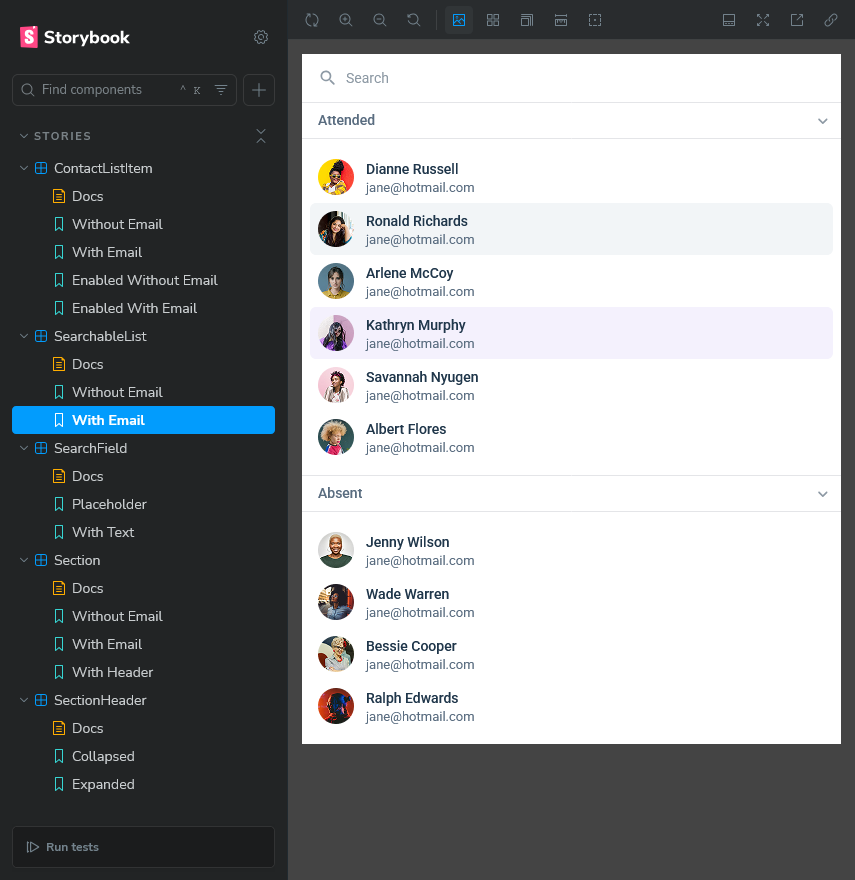

# aXcelerate Frontend Challenge

This repository contains the code for the aXcelerate frontend challenge, which involves implementing a searchable dropdown list containing contacts.

## Setup

1. Install [node](https://nodejs.org/en) if not already available. This repository was tested with version v22.14.0
2. Clone the repository `git clone https://github.com/JMSS-Unknown/axcelerate-frontend-challenge.git`
3. Navigate into the project `cd axcelerate-frontend-challenge`
4. Install dependencies `npm i`

## Running

- To start the dev server `npm run dev`
- To start Storybook `npm run storybook`
- To run tests `npm run test`
- To run linters `npm run lint`

## Notes

- The main component can be found in `src/components/SearchableList/index.tsx`
- The React app is bundled by Vite and Vitest is the test runner
- Styling is done through CSS modules
- Design tokens can be found in `src/assets/css`
